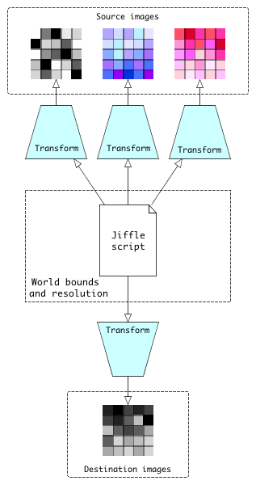

Working with coordinate systems
===============================

Up until now, the scripts we've been looking at have worked directly with image coordinates, ie. pixel positions. This
chapter introduces the concept of the *processing area*, also referred to as the *world* which allows you to write your
scripts in terms of other coordinate systems such as proportional or geographic distance. You can also use it to deal
with source and destination images that have non-overlapping bounds or different resolutions.

To get the flavour of this, let's look again at the *ripples* script which we saw in the :doc:`introduction`:

.. literalinclude:: /../src/main/resources/it/geosolutions/jaiext/jiffle/docs/Ripples.jfl

The variables *dx* and *dy* are the proportional X and Y distances of the current pixel from the image centre *(xc,
yc)*. We use these to calculate the scalar proportional distance *d* which is then fed to the trigonometric function.
You might have noticed that the way this script is written assumes that the image origin is at pixel position *(0, 0)*.
It could be generalized by using the coordinate functions *xmin()*, *ymin()*, *width()* and *height()*.

If we re-write the script to work in proportional coordinates directly, rather than image coordinates, it becomes a lot
simpler:

.. literalinclude:: /../src/main/resources/it/geosolutions/jaiext/jiffle/docs/RipplesProportionalCoords.jfl

We no longer need the variables *xc* and *yc* because the proportional X and Y distances from the image centre are now
simply *2 * (x() - 0.5)* and *2 * (y() - 0.5)* respectively. Also, unlike the previous script, this one will work
equally well with a destination image having a non-zero origin. So working in propoortional coordinates has made the
script both simpler and more general.

How Jiffle relates image and world coordinates
----------------------------------------------

When a Jiffle script is executed, any calls to coordinate functions such as *x()* (which returns the X ordinate of the
current processing position) or *width()* (which returns the width of the processing area) return values in *world
units*. When reading a value from a source image, or writing a value to a destination image, Jiffle converts the
position from *world coordinates* to a pixel lcoation using the **CoordinateTransform** associated with the image.

Note that CoordinateTransforms are run-time objects. You don't need to worry about the transforms in the script itself.
Instead, you write the script using whatever coordinate system is most appropriate for the application, then provide the
necessary transforms at run-time to convert between world and image coordinates. 

If you are working directly with image coordinates in your script you don't need to worry about coordinate transforms
because Jiffle will create a default identity transform for each image automatically. Similarly, if your script makes no
explicit reference to coordinates then, once again, you can simply let Jiffle create the default transforms behind the
scenes.

Defining the processing area
----------------------------

To execute a script, the Jiffle runtime system needs to know the bounds of the processing area and the pixel dimensions,
both of which are expressed in world units. If you don't supply these explicitly, it will create a default processing
area for you based on the first destination image that was associated with the runtime object or, if there are not
destination images, the first source image. In this case, processing area is simple the image area, and world units will
be equivalent to pixel coordinates.

You can define your own processing area using one of two methods::

  // Define bounds and pixel dimensions in world units

Creating coordinate transforms
------------------------------

The script below reads images representing tree cover in 1990 and 2010 and calculates the proportional change of tree
cover in a 1km block around each pixel. It defines a constant, RADIUS, which is expressed in map units (metres).  The
xres() and yres() functions are used to get the pixel width and height in metres, while the x() and y() functions return
the location (map reference) of the current pixel being processed.

.. literalinclude:: /../src/main/resources/it/geosolutions/jaiext/jiffle/docs/treechange.jfl

If all three images have the same bounds and resolution, we can use a single CoordinateTransform to convert between world locations and image locations:

.. literalinclude:: /../src/main/java/it/geosolutions/jaiext/jiffle/docs/TreeChange.java
   :language: java
   :start-after: // docs start
   :end-before: // docs end

If the images had different bounds and/or resolutions, we would give each its own CoordinateTransform.

